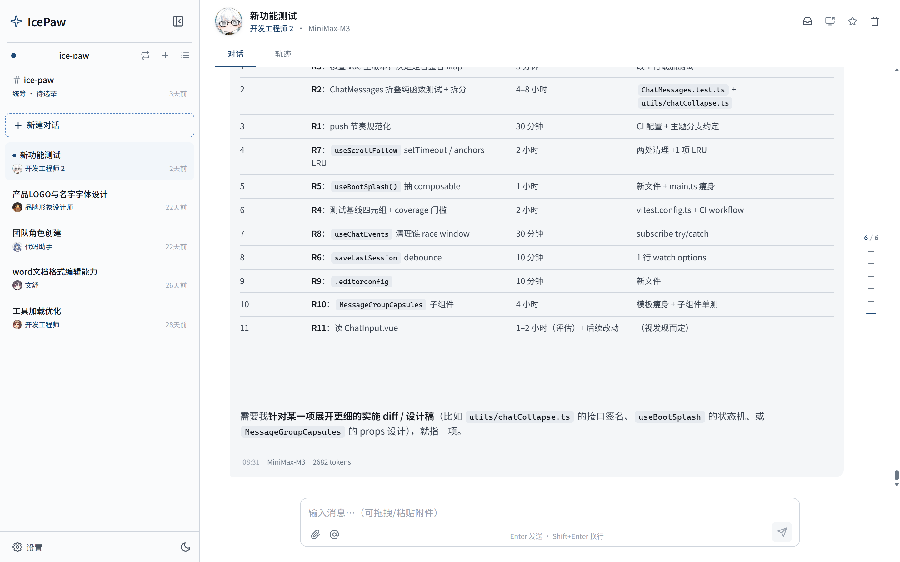
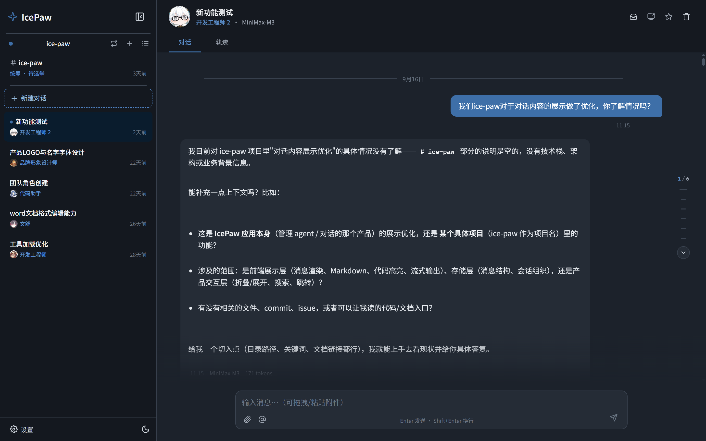
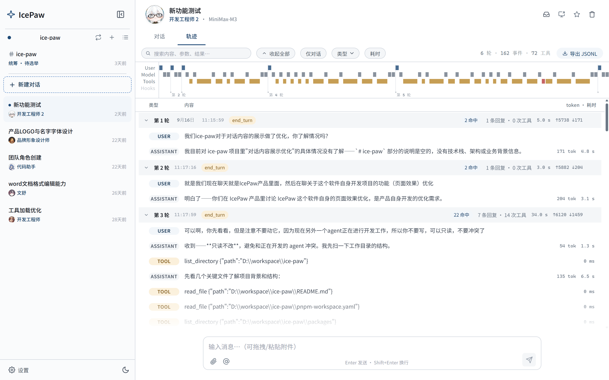

<div align="center">

# IcePaw

### 本地优先的 AI 多 Agent 桌面工作站

多个 AI Agent 在本地为你工作——对话、写文档、跑命令、看屏幕，数据不离开你的电脑。

[](https://github.com/SakuraSmiles/ice-paw/actions/workflows/ci.yml)
[](https://opensource.org/licenses/MIT)
[](https://github.com/SakuraSmiles/ice-paw/releases)

</div>

## 界面预览



| 深色主题 | 会话轨迹 |
|---|---|
|  |  |

---

## 功能特性

- **多 Agent 协作**：委派（同步任务单元）、跨会话信箱（异步互投）、频道（成员群聊共享流）三种模式
- **生成中插话**：不用等 AI 说完——在工具边界干净截断，插话排队后自动续跑
- **工具调用**：Shell、文件读写、Git、网页抓取，MCP 扩展（stdio / streamable HTTP）
- **Word 文档**：结构化读取、精确编辑（表格 / 样式 / 批量事务）、从模板生成整篇文档
- **屏幕读写**：截图、点击、键鼠操作——一次授权全会话免逐次弹卡，物理输入优先让路
- **知识库**：本地文档自动索引，语义检索引用
- **模型配置实体化**：Key 一处配置全局生效，多档降级链自动容错
- **本地优先**：SQLite + Stronghold 加密落盘，不上传、不注册、断网可开箱

每次对话都是可回放的事件流（轨迹页审计 / 导出）；Agent 可以帮你创建和修改 Agent（提案卡片审批，Agent 全程无写权限）。

## 配置要求

模型调用在云端完成，本地只运行界面与工具——对硬件要求很低。

- 系统：Windows 10 及以上（安装包内置 WebView2 运行时，免管理员安装）；macOS Apple Silicon 从源码构建
- 内存：4 GB 起步，8 GB 及以上更流畅
- 网络：首次配置需要（填写 API Key），日常使用稳定连接即可

## 快速开始

- **普通用户**：下载安装包，双击安装，首启后创建第一个 Agent
- **开发者 / macOS 用户**：从源码构建（见下）

### 下载安装

从 [Releases](https://github.com/SakuraSmiles/ice-paw/releases) 页面下载 Windows 安装包（NSIS `.exe`）。

首次打开后，在设置中创建你的第一个 Agent（选 Provider、填 API Key、选模型），然后直接开始对话；也可以对它说「帮我创建一个写代码的 agent」——Agent 提交提案卡片，你填 Key 点批准即可。

### 从源码构建

```bash
git clone https://github.com/SakuraSmiles/ice-paw.git
cd ice-paw
pnpm install
pnpm tauri:build   # 产物在 packages/app/src-tauri/target/release/bundle/
```

需要 Node.js 20+、pnpm、Rust 工具链；macOS 另需 `brew install libsodium`，Windows 的 sodium 路径见 [CONTRIBUTING](CONTRIBUTING.md)。

## 文档

- [使用指南](docs/user-guide.md)
- [贡献指南](CONTRIBUTING.md)

## 常见问题

**支持哪些 Provider？**  
OpenAI、Anthropic、智谱 GLM、DeepSeek、MiniMax，以及任何兼容 OpenAI 或 Anthropic 格式的 API 端点。

**数据怎么迁移？**  
将 `ice-paw.db`、`stronghold.hold` 和 `images/` 目录一起复制到新设备的应用数据目录即可。各平台路径见[使用指南](docs/user-guide.md)。

**遇到问题怎么反馈？**  
[提交 Issue](https://github.com/SakuraSmiles/ice-paw/issues)（带上版本号与日志片段会大大加快定位）。

---

MIT © IcePaw Contributors
