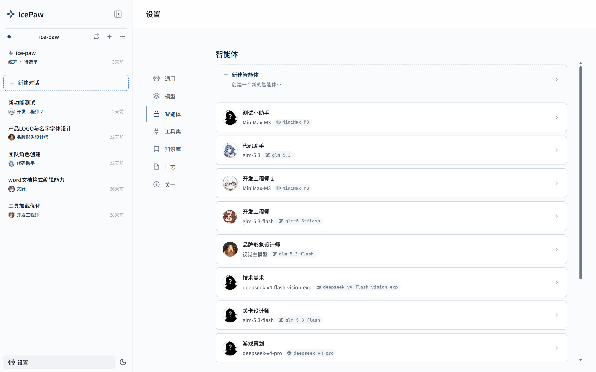
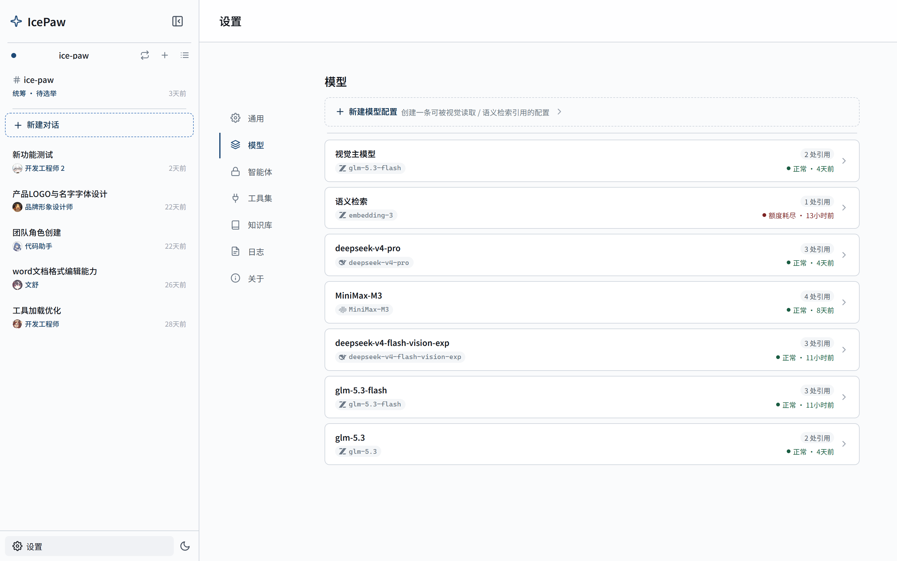
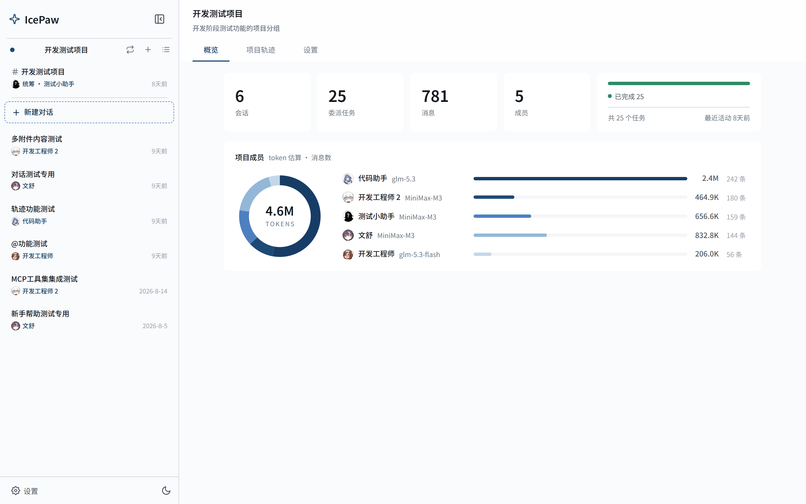
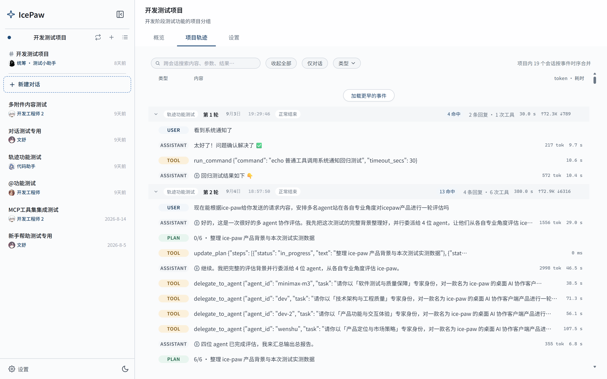
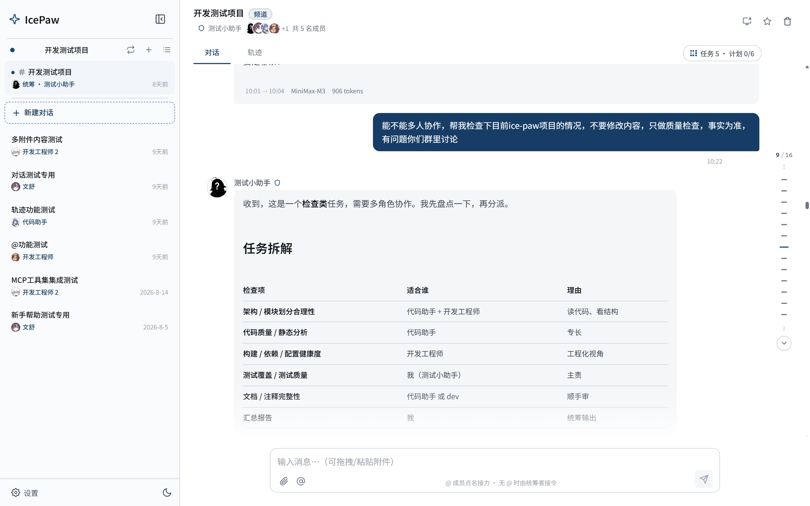
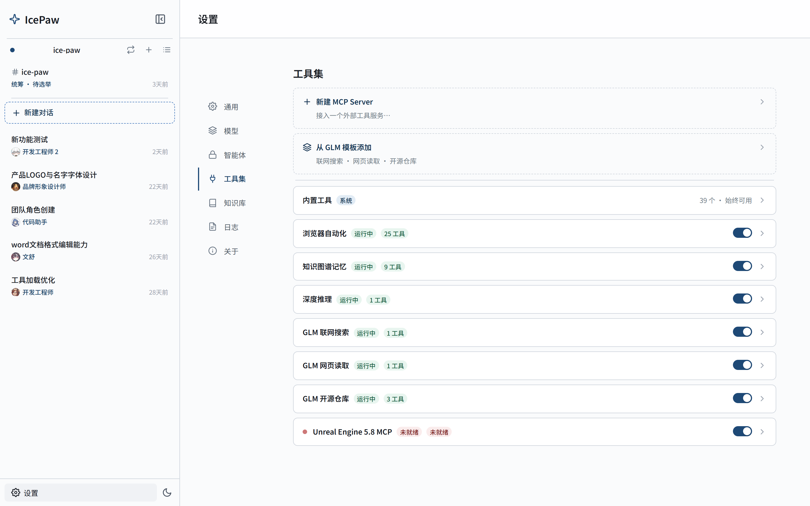
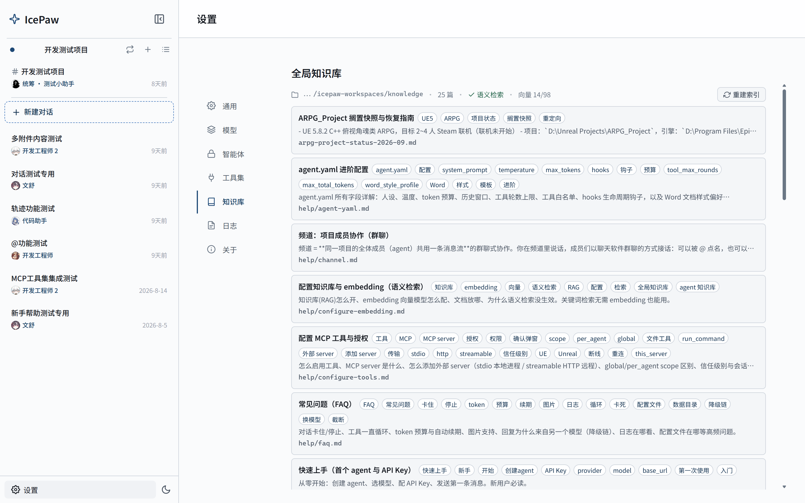
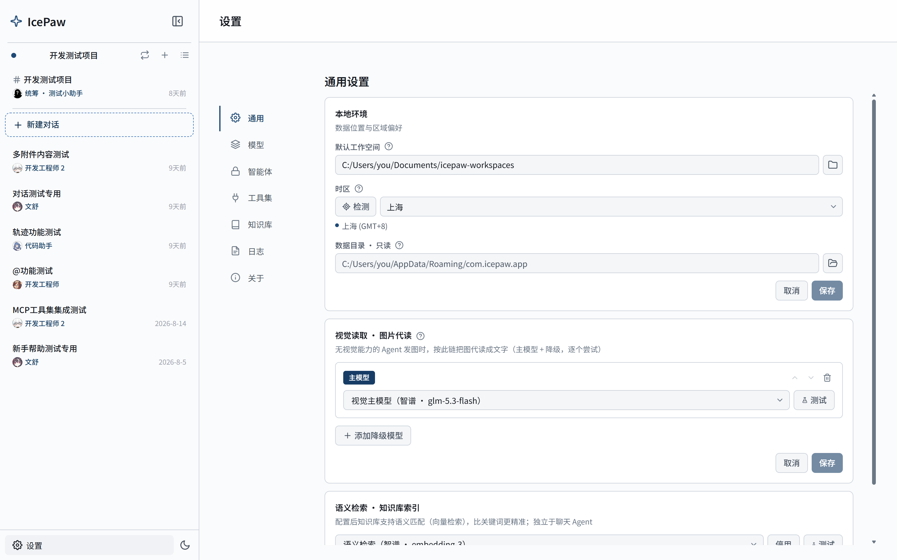

# 使用指南

> 适用于 0.9.x。产品内也有帮助：给任意 Agent 说「打开知识库帮助」或在知识库里找「帮助」文档，有每项能力的详细说明。

## 安装与首次启动

从 [Releases](https://github.com/SakuraSmiles/ice-paw/releases) 页面下载 Windows 安装包（NSIS `.exe`，内置离线 WebView2 运行时，免管理员安装）。macOS（Apple Silicon）目前从源码构建（见 [CONTRIBUTING](../CONTRIBUTING.md)）。

首次启动会在本地自动创建 SQLite 数据库与 Stronghold 加密 vault——无需注册账号、无需联网。卸载不会删除你的数据；彻底清理请删除下方「数据目录」整个文件夹。

## 快速上手：第一个 Agent

**设置 → Agent → 新建**：填写名字、选厂商（OpenAI / Anthropic / 智谱 / DeepSeek / MiniMax 或任何兼容端点）、选模型、填 API Key。保存即可回到主页开聊。

保存时后端会自动把「厂商 + 模型 + 端点 + Key」物化成一条**模型配置**（见「模型配置与降级链」）——同样的配置只存一份，换 Key 一处生效全局。API Key 只进 Stronghold 加密 vault，数据库不落明文，也不会发送给任何第三方。

也可以**在对话里让 Agent 帮你建 Agent**：说「帮我创建一个写代码的 agent」，Agent 会提交提案卡片——字段可编辑、API Key 槽位由你亲手填写（Agent 全程碰不到真实密钥），点批准才生效。



## 对话

侧栏「新建对话」选择 Agent 开始。回复流式渲染；Agent 调用工具时会显示工具卡片（参数、结果、行级 diff），点击展开详情。


### 生成中插话

Agent 正在生成时你仍然可以直接发送——在途回复会在下一个工具边界干净截断（已写出的内容保留），你的新消息以「排队中」角标呈现，静默几秒（连发的插话会等到齐）后自动续跑处理。不必等它说完。

### 图片与文档

输入框一个按钮统一添加附件：图片（单张 ≤5MB）、`.docx` / `.xlsx` / `.xls` / `.pdf`（≤100MB，自动分页提取为文本）。有视觉能力的模型直接看图；没有视觉能力的模型自动走「视觉代读」（在设置 → 通用配置一个视觉模型，图片会被代读成文字描述，而不是被丢弃）。

### 会话操作

- **重命名**：点会话头部标题进入编辑，显式「保存」或「取消」
- **置顶**：会话头部星标按钮
- **删除**：会话头部删除按钮（两步确认，不可恢复）
- 生成中切换到其他会话再切回来，已生成的部分会保留

## 定时任务

到点自动执行一轮完整的 Agent 任务（带工具与轨迹）。**设置 → 定时任务**新建：名称、Agent、调度（每天/每周几/每隔 N 分钟/一次性/cron）、提示词；也可以在对话里直接说「每天早上 9 点汇总项目进展」让 Agent 创建、修改或删除任务。

每个任务有自己的**专属会话**（历史跨执行累积，Agent 记得上次的结果）；侧栏项目切换器的「定时任务」空间归集全部任务会话；侧栏左下角常驻最近执行与下次预告。进阶项：**无人值守预授权**（默认需确认的工具调用 2 分钟无人响应按拒绝处理，可配置命令或全部工具免确认）、**结果转发**（每轮结果投递到指定会话）、**错过策略**（应用没开时补跑一次或顺延留痕）。

## Agent 进阶

### agent.yaml

为 Agent 指定 workspace 后，可在该目录放置 `agent.yaml` 覆盖专家旋钮（`system_prompt` / `temperature` / `max_tokens` / `enabled_tools` / `word_style_profile` / `hooks` 等），修改即时生效。出生证字段（名字、厂商、模型、Key）走应用界面管理，不进 yaml。

在应用里也有「打开 agent.yaml」入口；Agent 还可以通过提案通道请求修改自己的配置（仍需你批准）。

### 风格

Agent 的 System Prompt 是它的人格——设置里提供三档风格预设素材，插入即文本，之后随意改，零版本纠缠。

### 对话钩子（hooks）

`agent.yaml` 中可配置四个触发点的自动动作（注入 prompt / 调用工具 / 记日志）：

```yaml
hooks:
  conversation_start:
    - action: inject_prompt
      content: "本次对话全程使用中文回复。"
  after_tool:
    - action: log
      message: "工具执行完毕。"
```

触发点：`conversation_start` / `before_llm` / `after_tool` / `conversation_end`。钩子失败只记警告，不打断对话。

## 模型配置与降级链

**设置 → 模型** 是模型配置的实体库：每条配置（别名、厂商、模型、端点、Key）独立管理，「测试」按钮真发一次小请求验证对话权益；健康状态（正常 / 额度耗尽 / 未调用）随调用归因。



编辑 Agent 时通过合并 tag 选择器挂链：首位是主档，其后是**降级链**——主档额度耗尽或被限流时自动换下一档继续跑（换档有 toast 提示，事件入轨迹），链尽才走原终态。视觉读取与知识库语义检索各自的模型也在**设置 → 通用**里引用同库配置。

## 项目空间与频道

### 项目

侧栏切到项目后，会话与 Agent 按项目归类；项目可指定 workspace（作为文件工具的默认工作目录）、管理成员 Agent。项目可归档（收起但数据完整）；永久删除时可选「连同会话删除」或「仅删项目、会话转散落保留」。



### 项目轨迹页

项目详情的「时间线」跨会话回放全量事件流——每轮对话的工具调用、预算消耗、成员接力一屏可查，支持按类型筛选与全文搜索。



### 频道（群聊）

项目成员可开启**频道**：全体成员共用一条消息流，一个时刻只有一人在发言。@ 点名指定谁接力；不点名则由统筹者接令（自己答或分派给合适的成员）；护栏自动截断接力风暴。频道里生成中发消息同样不拦截（新链头接管）。



## 多 Agent 协作

- **委派**：Agent 把子任务委派给其他 Agent——每个委派是完整子会话（有自己的轨迹、预算与工具授权），进度实时汇报回父对话，任务面板可查
- **跨会话信箱**：会话之间异步互投消息（同项目内），收件策略可设自动接收 / 需批准 / 拒收；期待回复的来件在对方回答后自动回投
- 与频道的分工：委派是「同步干活的任务单元」、信箱是「异步留言」、频道是「大家都在场的群聊」

## 工具与授权



### 内置工具

开箱即用，按族分组：文件读写与目录（read/write/edit/move/search 等）、Shell 命令、只读 Git、网页抓取、知识库检索、附件分页读取、Word 文档（读取投影 / 精确编辑 / 整篇生成）、屏幕读写（截图 / 点击 / 键鼠）、配置提案。设置 → 工具 里可看完整清单。

### 授权四档

工具调用弹卡批准时可选：**仅此一次** / **此目录**（同目录后续免问）/ **此 Server（本会话）**（整台外部 Server 的全部工具本会话免问）。安全只读类（如 `git status`）不弹卡直接执行；同类操作获批后有会话级授权记忆。

### 工具面收窄

编辑 Agent 可收窄它的工具面：按内置组（文件 / Word / 屏幕等）、按外部 Server、或按单个工具名勾选——收窄只影响「看得到什么」，授权弹卡仍是安全边界。

### 外部 MCP Server

设置 → 工具 添加外部 MCP Server，支持 **stdio**（如 `npx -y …`）与 **streamable HTTP**（如 UE5 内置 MCP 的 `http://localhost:8000/mcp`）两种传输。断线后自动懒重启重试一次（禁用的 Server 永不自动复活）；外部 Server 子进程的环境变量经白名单过滤，不泄漏本机 API Key。

## Word 文档能力

Agent 能直接处理 Word：读取时给模型结构化投影（大纲 / 格式 / 表格网格）；编辑走精确操作（替换 / 插段 / 表格手术 / 样式定义），批内事务全有或全无、写前自动备份；也可以从模板一次生成整篇文档（自动目录、生成自检不过不落盘）。样式偏好可写进 agent.yaml 的 `word_style_profile`。

## 屏幕读写

需要看屏幕的 Agent 可申请**屏幕共享会话**——批准一次，本轮会话内截图 / 点击 / 键鼠操作免逐次弹卡；共享期间桌面有红边框与 HUD 工具栏，你可以随时暂停或终止；你本人在用键鼠时 Agent 自动让路。

## 知识库

把本地文档目录绑定为知识库后，Agent 通过 `search_kb` 语义检索引用。三级作用域：全局（设置 → 知识库）、Agent 级（`<workspace>/kb/`）、项目级（`<project_workspace>/kb/`）。放入即自动索引、改动同步更新；配置 embedding 模型后按语义相似度排序（模型在设置 → 通用 配置）。应用自带帮助文档（在知识库里），Agent 也能自己查操作事实。



## 设置总览



| 页 | 管什么 |
|---|---|
| 通用 | 默认 workspace、时区、主题、视觉读取与语义检索的模型引用 |
| 模型 | 模型配置实体库（新建 / 编辑 / 测试 / 健康状态） |
| 定时任务 | 按计划自动执行的任务（新建 / 启停 / 执行记录 / 立即运行） |
| Agent | Agent 出生证管理、编辑、agent.yaml 入口 |
| 工具 | 内置工具清单、外部 MCP Server、工具面 |
| 知识库 | 全局知识库目录绑定与索引 |
| 日志 | 按天轮转的运行日志（排障先看这里） |
| 关于 | 版本、标识符、许可 |

## 数据、迁移与日志

各平台应用数据目录：

| 平台 | 路径 |
|------|------|
| Windows | `%APPDATA%\com.icepaw.app\` |
| macOS | `~/Library/Application Support/com.icepaw.app/` |
| Linux | `~/.local/share/com.icepaw.app/` |

目录主要内容：`ice-paw.db`（对话与配置）、`stronghold.hold`（加密 vault）、`images/`（图片外置内容——迁移必带，否则历史图片不可恢复）、`logs/`（运行日志）、`templates/`（Word 共享模板）。

**迁移到新设备**：把整个应用数据目录复制到新设备对应路径即可。数据不出本机——同步、备份策略由你自己的工具决定。

## 反馈

遇到问题或想提议功能请[提交 Issue](https://github.com/SakuraSmiles/ice-paw/issues)——bug 报告带上版本号（设置 → 关于）与日志片段（设置 → 日志）会大大加快定位。
